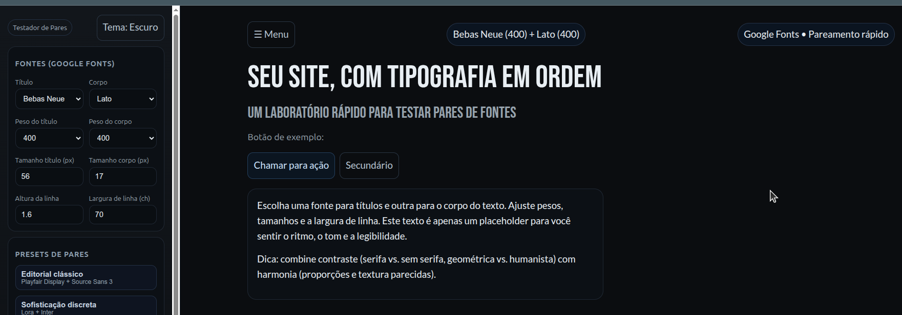
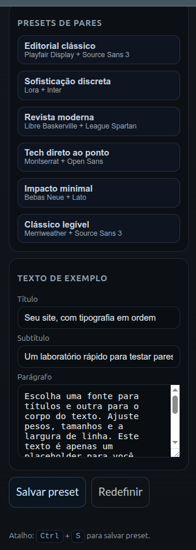

# 🇧🇷 font-pairing-tester

[🇺🇸 Read in English](#-font-pairing-tester-english)

Ferramenta para testar combinações de fontes do Google Fonts em tempo real — título e corpo separados, com ajuste ao vivo de peso, tamanho, altura de linha e largura de coluna. Arquivo único, sem build, sem dependências além do carregamento dinâmico das fontes.

## Funcionalidades

- Catálogo curado de fontes do Google Fonts, com pares pré-configurados (editorial, revista, tech, impacto minimal, entre outros)
- Ajuste independente de família, peso, tamanho e altura de linha para título e corpo
- Tema claro/escuro
- Estado e presets salvos no navegador (`localStorage`) — persiste entre sessões
- Atalho `Ctrl`/`Cmd` + `S` para salvar um preset
- Layout responsivo com menu lateral em formato *drawer* no mobile, incluindo gesto de arrastar da borda da tela pra abrir/fechar

## Como rodar

Basta abrir o `index.html` direto no navegador — não precisa de servidor nem instalação.

## Stack

- HTML, CSS e JavaScript vanilla (sem frameworks, sem build step)
- Google Fonts (carregamento dinâmico via `<link>`)

---

# 🇺🇸 font-pairing-tester (English)

[🇧🇷 Ler em Português](#-font-pairing-tester)

A tool for testing Google Fonts combinations in real time — separate heading and body fonts, with live adjustment of weight, size, line height, and column width. Single file, no build step, no dependencies beyond the dynamic font loading.

## Features

- Curated catalog of Google Fonts, with pre-configured pairings (editorial, magazine, tech, minimal impact, and others)
- Independent control of family, weight, size, and line height for heading and body
- Light/dark theme
- State and presets saved to the browser (`localStorage`) — persists across sessions
- `Ctrl`/`Cmd` + `S` shortcut to save a preset
- Responsive layout with a drawer-style side menu on mobile, including an edge-swipe gesture to open/close it

## How to run

Just open `index.html` directly in a browser — no server or install needed.

## Stack

- Vanilla HTML, CSS, and JavaScript (no frameworks, no build step)
- Google Fonts (dynamically loaded via `<link>`)